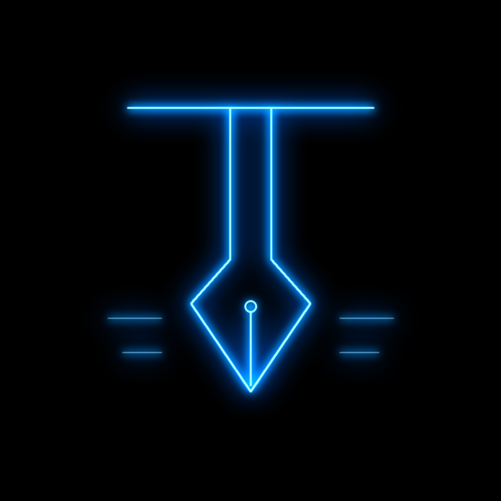

# Typographus — Editorial & Typesetting Engine

Motore di desktop publishing focalizzato sulla formattazione automatica e la
disposizione tipografica ad altissima precisione a partire da sorgenti
**Markdown / Plain Text / DOCX**. Interfaccia in **Material Design 3**
(palette generata dal blu neon del marchio, tema chiaro/scuro).



## Avvio

Typographus è un'**applicazione desktop** (Electron) con titlebar custom.

```bash
npm install

# App desktop
npm run app          # compila e avvia l'app desktop
npm run dist:win     # crea l'installer Windows (.exe) in release/

# Sviluppo
npm run dev          # dev server web su http://localhost:5174
npm run app:dev      # finestra desktop collegata al dev server (hot reload)
```

> `npm run app:dev` richiede che `npm run dev` sia già in esecuzione.
> L'anteprima impaginata usa `requestAnimationFrame`: tieni la finestra in
> **primo piano** durante l'impaginazione.

## Funzionalità

### A. Compilatore di layout (Markdown → stampa)
- Import diretto di `.md`, `.txt`, `.docx` (Word, via *mammoth*) — anche con
  drag & drop sull'area di anteprima.
- Anteprima **continua (bozza)** in tempo reale e **impaginato reale** con
  interruzioni di pagina via *Paged.js*.
- Regole tipografiche: **sillabazione multilingua**, controllo di **orfane e
  vedove**, **legature**, cifre minuscole (oldstyle), capolettera.

### B. Griglie e guide
- Formati A3/A4/A5/Letter/Tabloid + personalizzato, orientamento, margini.
- Colonne (1–3) con filetto, **griglia di base**, **guide auree** e pulsante
  "margini aurei automatici" (canone 1:2 interno/esterno).
- **Abbondanza (bleed)**, **crocini di taglio e registro**, numeri di pagina e
  testatina corrente — riportati nel PDF.

### C. Esportazione ad alta fedeltà
- **PDF di stampa** via pipeline del browser (CMYK + profilo **ICC**
  selezionabile, bleed e crocini inclusi).
- **ePub 3** re-flowable validato (XHTML pulito, navigazione EPUB3 + NCX,
  metadati Dublin Core) generato client-side con *JSZip*.
- **HTML** autonomo. Indice generale (TOC) automatico dai titoli.

### Funzioni editoriali/giornalistiche aggiuntive
- **Testata articolo** (front-matter): occhiello, titolo, sommario, firma,
  dateline, sezione — composti automaticamente in testa all'impaginato e nella
  copertina ePub.
- **Revisione**: indice di leggibilità **Gulpease** (italiano) + **Flesch**,
  tempo di lettura e di lettura a voce, statistiche del testo.
- **Copyfitting**: obiettivo parole, scarto e stima dello spazio occupato
  (pagine, caratteri/riga, righe/pagina).
- **Linter di stile redazionale**: virgolette dritte, apostrofi, spazi doppi,
  trattini, ellissi… con correzione one-click ("tipografia intelligente").
- **Pull quote** e **didascalie/crediti** immagine, **anteprima separazione
  CMYK**.

## Sintassi editoriale (estensioni Markdown)

```text
:::pullquote
Frase in evidenza.
:::

     → figura ancorata con credito
testo[^1]   …   [^1]: nota                    → note dinamiche numerate
```

La testata (occhiello, titolo, sommario, firma…) si imposta dal pannello
**Documento**.

## Stack tecnico
TypeScript + Vite · Material Design 3 (design system custom, token-driven) ·
Paged.js (impaginazione) · marked (Markdown) · mammoth (DOCX) · JSZip (ePub).
Nessun framework UI: componenti MD3 costruiti a mano.

## Struttura
```
src/
  state.ts        stato + persistenza (localStorage)
  typography.ts   compilatore Markdown→HTML, smart typography
  paginate.ts     galley + integrazione Paged.js
  metrics.ts      leggibilità, copyfitting
  linter.ts       regole di stile redazionale
  importers.ts    md / txt / docx
  exporters.ts    PDF / ePub / HTML / TOC
  app.ts          shell, navigazione, pannelli ispettore
  ui.ts           helper componenti MD3
  styles/         tokens · base · components · app · document
```

Il marchio è il pennino-T blu neon (`public/icon.png`, `public/icon.ico`):
l'app può essere impacchettata come desktop (Tauri/Electron) riusando l'icona.
